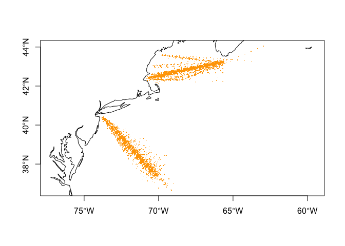

cprdata
================

This R package facilitates access and analysis of
[NFSC](https://www.fisheries.noaa.gov/about/northeast-fisheries-science-center)
[Continuous Plankton
Recorder](https://en.wikipedia.org/wiki/Continuous_Plankton_Recorder)
(CPR) data. Data can imported from distrubuted
[Excel](https://en.wikipedia.org/wiki/Microsoft_Excel) spreadsheets into
data frames, [tibbles](https://tibble.tidyverse.org/) or [sf
tables](https://r-spatial.github.io/sf/).

> Part of this dataset was obtained from [NOAA’s
> NFSC](https://www.fisheries.noaa.gov/about/northeast-fisheries-science-center)
> on 20 January 2024 and might not represent the most up to date data.
> Please contact NOAA directly for the most recent data. The balance of
> this dataset is avaiable from the [NERACOOS ERDDAP
> server](https://www.neracoos.org/erddap/index.html).

## Requirements

- [R v4.1+](https://www.r-project.org/)
- [rlang](https://CRAN.R-project.org/package=rlang)
- [dplyr](https://CRAN.R-project.org/package=dplyr)
- [readxl](https://CRAN.R-project.org/package=readxl)
- [stringr](https://CRAN.R-project.org/package=stringr)
- [readr](https://CRAN.R-project.org/package=readr)

## Installation

    remotes::install_github("BigelowLab/cprdata")

## Usage

### Read the data

The dataset contains both zooplankton and phytoplankton data from the
Mid-Atlantic Bight and Gulf of Maine regions. We regularily access to
the zooplankton data, but it is easy to switch to phytoplankton. We can
read the data in its “raw” state as a simple table or transformed into a
[sf](https://r-spatial.github.io/sf/) POINT table.

#### Read as a wide table

``` r
library(cprdata)
x = read_cpr(name = "phytoplankton", form = "table") |>
  dplyr::glimpse()
```

    ## Rows: 1,649,128
    ## Columns: 9
    ## $ source    <chr> "nfsc", "nfsc", "nfsc", "nfsc", "nfsc", "nfsc", "nfsc", "nfs…
    ## $ cruise    <chr> "EG7107", "EG7107", "EG7107", "EG7107", "EG7107", "EG7107", …
    ## $ station   <dbl> 43, 43, 43, 43, 43, 43, 43, 43, 43, 43, 43, 43, 43, 43, 43, …
    ## $ time      <dttm> 1971-11-15 17:00:00, 1971-11-15 17:00:00, 1971-11-15 17:00:…
    ## $ lon       <dbl> -71.7666, -71.7666, -71.7666, -71.7666, -71.7666, -71.7666, …
    ## $ lat       <dbl> 39.6, 39.6, 39.6, 39.6, 39.6, 39.6, 39.6, 39.6, 39.6, 39.6, …
    ## $ pci       <dbl> 1, 1, 1, 1, 1, 1, 1, 1, 1, 1, 1, 1, 1, 1, 1, 1, 1, 1, 1, 1, …
    ## $ abundance <dbl> 0.0, 0.0, 0.0, 0.0, 0.0, 0.0, 0.0, 0.0, 0.0, 0.0, 0.0, 0.0, …
    ## $ name      <chr> "Paralia sulcata [9000]", "Skeletonima costatum [9001]", "Th…

#### Read as a sf POINT table

Note that we switch to reading zooplankton data and add a `stage`
variable.

``` r
x = read_cpr(name = "zooplankton",  form = "sf") |>
  dplyr::glimpse() 
```

    ## Rows: 5,697,206
    ## Columns: 9
    ## $ source    <chr> "nfsc", "nfsc", "nfsc", "nfsc", "nfsc", "nfsc", "nfsc", "nfs…
    ## $ cruise    <chr> "EG7107", "EG7107", "EG7107", "EG7107", "EG7107", "EG7107", …
    ## $ station   <dbl> 43, 43, 43, 43, 43, 43, 43, 43, 43, 43, 43, 43, 43, 43, 43, …
    ## $ time      <dttm> 1971-11-15 17:00:00, 1971-11-15 17:00:00, 1971-11-15 17:00:…
    ## $ pci       <dbl> 1, 1, 1, 1, 1, 1, 1, 1, 1, 1, 1, 1, 1, 1, 1, 1, 1, 1, 1, 1, …
    ## $ abundance <dbl> 0, 0, 0, 0, 0, 0, 0, 0, 0, 0, 0, 0, 0, 0, 0, 0, 0, 0, 0, 0, …
    ## $ name      <chr> "Unidentified plankton and fragments", "Copepoda", "Copepoda…
    ## $ stage     <chr> "unstaged", "nauplius", "copepodite v", "parva (postlarva)",…
    ## $ geometry  <POINT [°]> POINT (-71.7666 39.6), POINT (-71.7666 39.6), POINT (-…

#### Plot points

``` r
suppressPackageStartupMessages({
  library(sf)
  library(rnaturalearth)
})
coast = ne_coastline(scale = "medium", returnclass = "sf")
plot(st_geometry(coast), extent = x, axes = TRUE)
plot(st_geometry(x), pch = ".", col = "orange", add = TRUE)
```

<!-- -->
